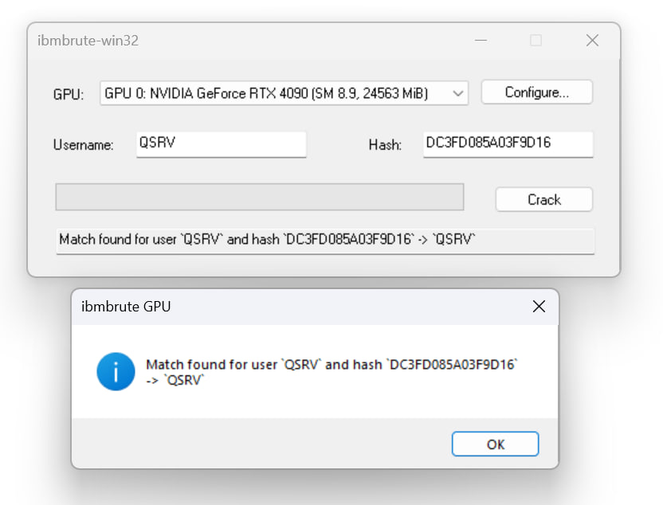

# ibmbrute 

A password brute-force tool for SST/DST users on IBM AS/400 systems.

This tool supports both multi-threaded CPU based cracking, Apple Metal-based cracking and NVIDIA CUDA-based cracking. 

The win32 variant of the tool is GUI-only, and only supports CUDA.

## Win32 usage



The GUI should be self-explanatory, but make sure to configure your selected GPU and tune the algorithm parameters for optimal performance.

A benchmarking tool is included in the release, which can be used to find optimal parameters for your GPU.

The released binaries only support RTX 2000 series cards or newer, and have only been extensively tested on RTX 4090 cards.


## CLI uage

```bash
./ibmbrute --help
```

## License 
This project is licensed under the MIT License.

## Credits

This tool would not be possible without the research and work of [p0dalirius](https://github.com/p0dalirius)